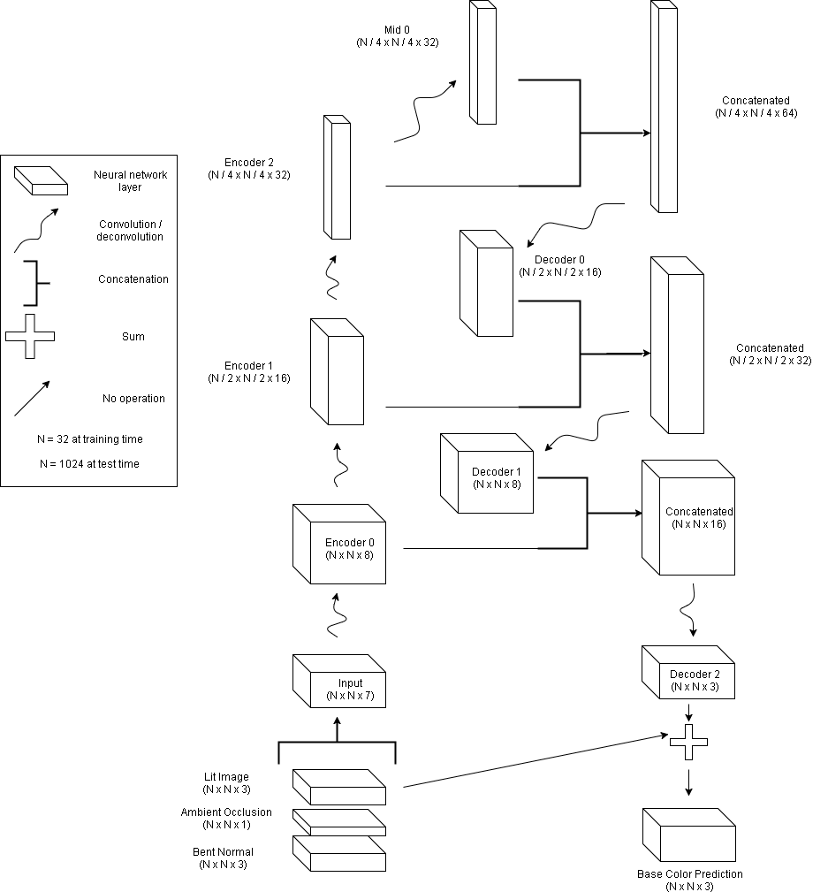

# Texture De-lighting
#### Project Managers: Zhongxia Yan, Michael Zhang
#### Team Members: Quinn Tran, Gefen Kohavi, Murtaza Dalal, Tracy Lou, Varsha Ramakrishnan

Machine Learning at Berkeley partnered with Unity Technologies to apply ML methods toward de-lighting surface texture.

## Background

Realistic in-game objects are often captured from the real world through a process called photogrammetry. Photogrammetry involves capturing images of all angles of an object (e.g. a rock) and then reconstructing the object from those images with 3D reconstruction techniques. **De-lighting** is necessary to remove the effect of non-uniform real world lighting and shadow on the object, so that the object can be re-lit by lighting within the game environment. Currently, de-lighting is manually done by artists.

## Data
We aimed to build models that operated on surface texture maps (i.e. the unwrapped surface of a 3D object), instead of operating on meshes directly. Our model takes in the lighted texture map and seeks to generate a de-lit texture map. Unity Technologies has several de-lit texture maps already (done by artists), so this serves as our desired output. To generate the lighted inputs into our models, Unity Technologies placed the de-lit meshes in various lighting conditions and generated the lit texture maps.

Below: left is de-lit by artist (our ground truth), right is lighted.

 
 

## Model
Our core model consists of a 4 layer encoder followed by a 4 layer decoder, with residual connections between the layers.

### Loss Function
We experimented with several loss functions on top of our core model.

#### L2
This is the pixelwise L2 loss between predicted texture map and desired texture map.

#### Gradient Difference
Let I(0, 0) be an image and let I(1, 0) be the image shifted one pixel to the right, and I(0, 1) be the image shifted one pixel up. We call the horizontal gradient I(0, 0) - I(1, 0), and the vertical gradient I(0, 0) - I(0, 1). We compute the horizontal and vertical gradients for the model output and desired output, then take the L2 loss between these two outputs for our gradient difference loss.

#### Adversarial
We train a convolutional discriminator to predict whether a texture map is a de-lit ground truth (vs generated by our generator).

#### Alpha Mask
Since our inputs have regions where alpha = 0 (see examples above), we tried applying a mask that only take the alpha > 0 regions into account when calculating the losses above.

## Results

